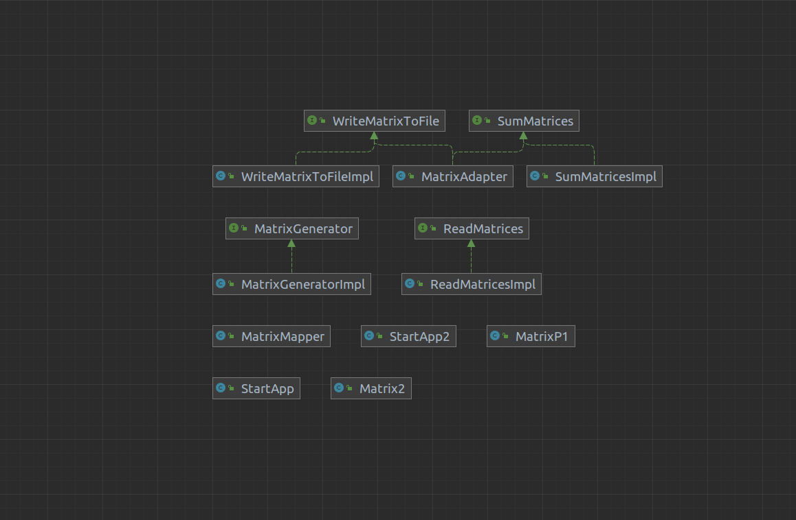

# pattern-adapter

Класс MatrixAdapter использует объекты, реализующие интерфейс MatrixGenerator, для генерации матриц.
Конструктор класса MatrixAdapter принимает объект, реализующий интерфейс MatrixGenerator.
Метод int[][] sumMatrices(MatrixP1 matrixP1) складывает сгенерированные матрицы, а метод void writeMatrix(int[][] matrix) записывает результат в файл.
Метод startProgram2() класса StartApp2 является точкой входа в программу.